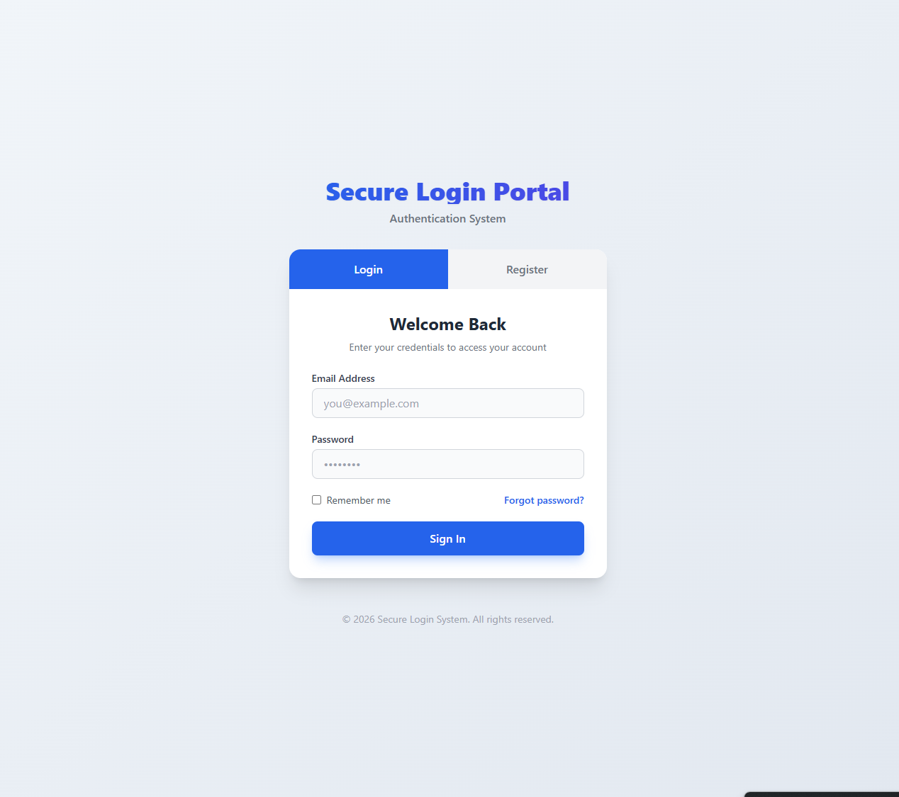
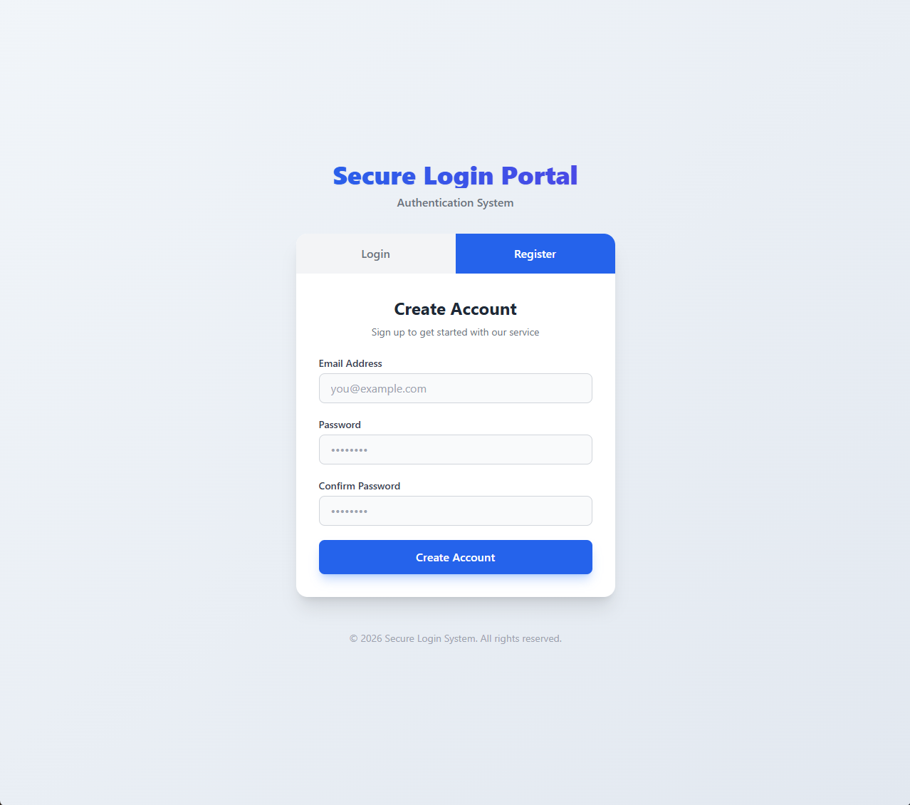
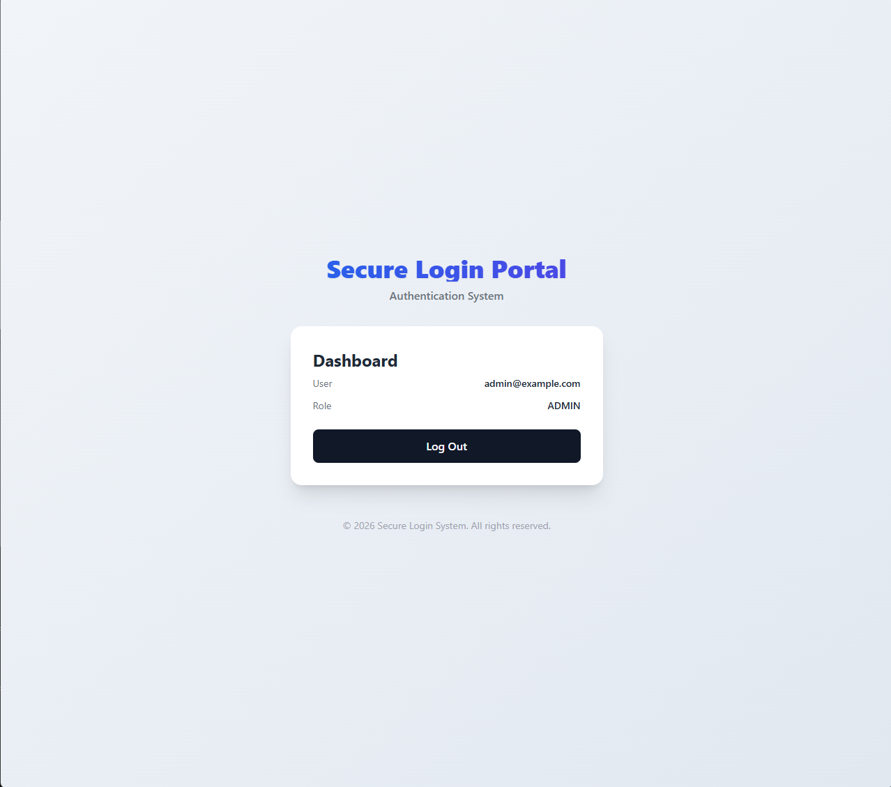
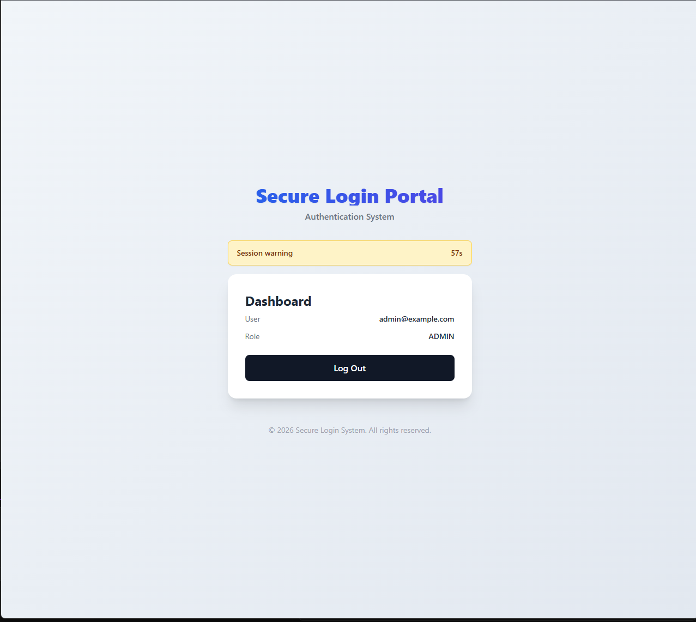
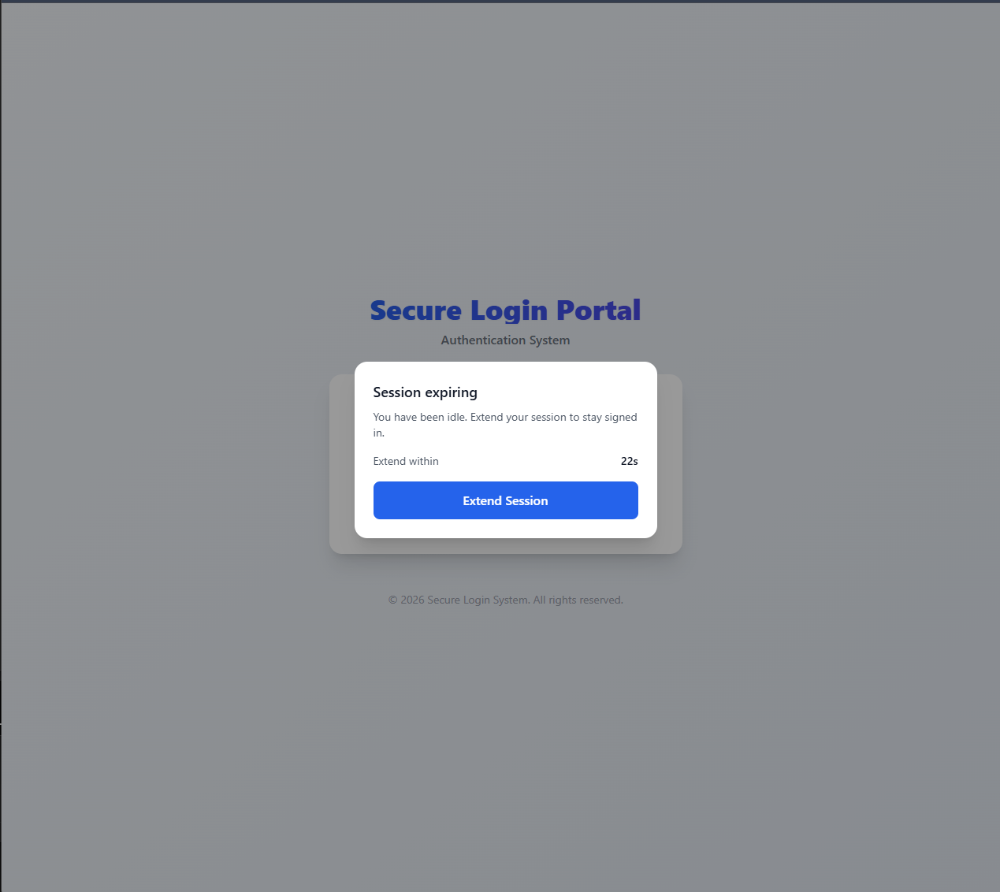

# Secure Login Assignment

Secure login portal with Spring Boot, React + TypeScript, and Docker. Built for the technical assignment for a software engineering position at BComSat.

## Features
- Registration and login with JWT-based sessions
- Secure password hashing and role-aware access
- Refresh token flow and session expiry handling
- Protected dashboard UI

## Instructions
- Copy `.env.example` to `.env` and update values if needed
- Start services: `docker compose up --build`
- Open the app at `http://localhost:5173`
## Screenshots
Login

Register

Dashboard

Session warning and expiry

## Technologies Used
- Backend: Spring Boot, Java, Spring Security, JWT
- Frontend: React, TypeScript, Vite, Axios, Tailwind CSS
- Infrastructure: Docker, Docker Compose

## Project Structure
- **/backend**: Spring Boot API
- **/frontend**: React SPA
- **/docker-compose.yml**: Container orchestration

